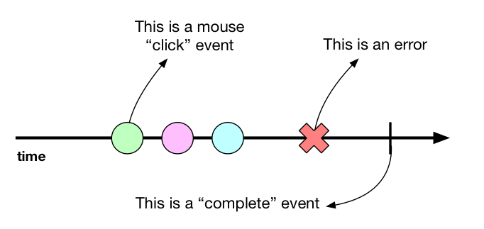

Today I am excited to announce a reactive programming library I wrote for
JavaScript, called [Bulb](https://github.com/nullobject/bulb).

The growing popularity of reactive programming in recent years has seen the
introduction of a number of reactive programming libraries for JavaScript (e.g.
RxJS, Bacon.js, Most.js, etc.). Most of these libraries go down the route of
providing the 'kitchen sink' — and are subsequently quite large — with complex
APIs.

Bulb focuses on delivering a very simple API (around 4 KB) that provides only
the key building blocks required for reactive programming in the JavaScript
language.


## What is Reactive Programming?

Before I get carried away talking about Bulb, it's probably worth pausing to
explain reactive programming.

Reactive programming is paradigm for writing event-based programs. The program
logic is expressed with *streams*, rather than by defining event handlers which
alter the program's state. This allows any asynchronous program to be expressed
as a sequence of simple operations on streams (e.g. `map`, `fold`, `zip`,
etc.), instead of writing a bunch of event-handling spaghetti code.

Bulb introduces an abstraction called a *signal* to represent a stream of data.
The term 'signal' is borrowed from the [hardware description
languages](https://en.wikipedia.org/wiki/Hardware_description_language), which
allow changes to be modelled as they travel through circuits. Much like in
electrical circuits, signals are an ordered time-varying source of values.
Signals can be created, merged, and changed using *combinator* functions.



There are three different kinds of values that can be emitted by a signal: data
(of any type), an error, or a 'complete' event. The diagram above shows the
timeline for a signal that emits mouse 'click' events. The signal can emit
multiple 'click' events or errors, but once the 'complete' event is triggered
the signal emits no more events.

When you want to observe a signal for changes, you must *subscribe* to it. Once
you have subscribed to a signal then it will start emitting values. Finally
when you are done observing a signal, then you can *unsubscribe* from a it.

Signals keep track of their subscribers — when the last observer unsubscribes
from a signal, then it will be automatically unmounted. The mounting and
unmounting of a signal starts and stops the flow of changes respectively. For
example, mounting a timer signal starts an internal timer with a `setInterval`
function call. When the signal is unmounted, then the `clearInterval` function
is called to stop the timer.

## A Timer

Enough talk! Let's take a look at a simple example: a timer which periodically
logs a random number to the console.

Normally we would do something like this:

```js
setInterval(() => {
  const n = Math.random()
  console.log(n)
}, 1000)
```

To express the above example as a reactive program with Bulb, we instead do the
following:

```js
import { Signal } from 'bulb'

Signal
  .periodic(1000)
  .map(Math.random)
  .subscribe(console.log)
```

Let's examine what is happening here. The `periodic` function creates a new
signal that periodically emits values. We then apply the `map` combinator to
map the periodic values to random numbers. Finally, we subscribe to the signal
and the emitted values are logged to the console.

Obviously this is quite a trivial example, but we can already see that by using
Bulb we are able to decompose this asynchronous program into an elegant
sequence of simple steps. Using the various combinator functions (like `map`)
provided by the Bulb API allows us rewrite any asynchronous program using
signals.

The full reactive example is [available
here](https://codepen.io/nullobject/pen/wpjQoM).

## Searching for Books

How about a more complex example: searching for an ISBN with the Google Books
API.

Normally this would involve creating multiple event listeners to handle the
program logic and keep track of the program state:

```js
const isbn = document.getElementById('isbn')
const button = document.getElementById('search')
let query = ''

isbn.addEventListener('input', () => {
  query = e.target.value
})

button.addEventListener('click', () => {
  const url = `https://www.googleapis.com/books/v1/volumes?q=isbn:${query}`
  fetch(url)
    .then(response => response.json())
    .then(data => {
      const title = data.items[0].volumeInfo.title
      console.log(title)
    })
})
```

To express the above example as a reactive program with Bulb, we instead do the
following:

```js
import { Signal } from 'bulb'

function findBook (isbn) {
  const url = `https://www.googleapis.com/books/v1/volumes?q=isbn:${isbn}`
  return Signal.fromPromise(fetch(url).then(response => response.json()))
}

const isbn = document.getElementById('isbn')
const button = document.getElementById('search')
const isbnValue = Signal.fromEvent('input', isbn).map(e => e.target.value)
const buttonClick = Signal.fromEvent('click', search)

isbnValue
  .sample(buttonClick)
  .concatMap(findBook)
  .map(data => data.items[0].volumeInfo.title)
  .subscribe(console.log)
```

What's going on here? The `sample` combinator creates a new signal which emits
the most recent ISBN value every time the search button is clicked. The
`concatMap` combinator is then used to call the `findBook` function, which
returns a signal that emits the response from the Google Books API request. We
then apply the `map` combinator to extract the book title from the response
data. Finally, we subscribe to the signal and the emitted values are logged to
the console.

It's worth pointing out that the above reactive example is purely *functional*.
In contrast to the imperative example, there is no intermediate state being
stored in variables — the behaviour of the program emerges only as a result of
calling pure functions on signals. It is precisely this fact that makes
reactive programs so easy to reason about.

The full reactive example is [available
here](https://codepen.io/nullobject/pen/QarojE).

## Learn Some More

Hopefully by now I have piqued your interest in Bulb and reactive programming
in general. Please be sure to take a look at the [Bulb project on
GitHub](https://github.com/nullobject/bulb) and read the [API
docs](https://bulb.joshbassett.info).

You may also want to do some more reading about reactive programming:

* [The introduction to Reactive Programming you've been missing](https://gist.github.com/staltz/868e7e9bc2a7b8c1f754)
* [Reactive programming vs. Reactive systems](https://www.oreilly.com/ideas/reactive-programming-vs-reactive-systems)
