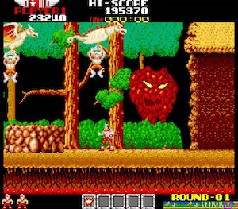
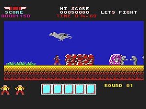
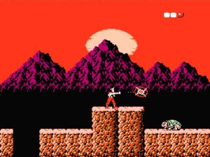
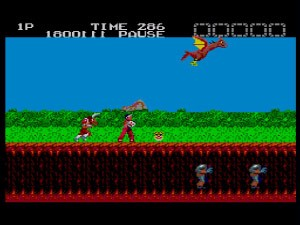
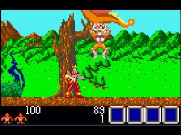
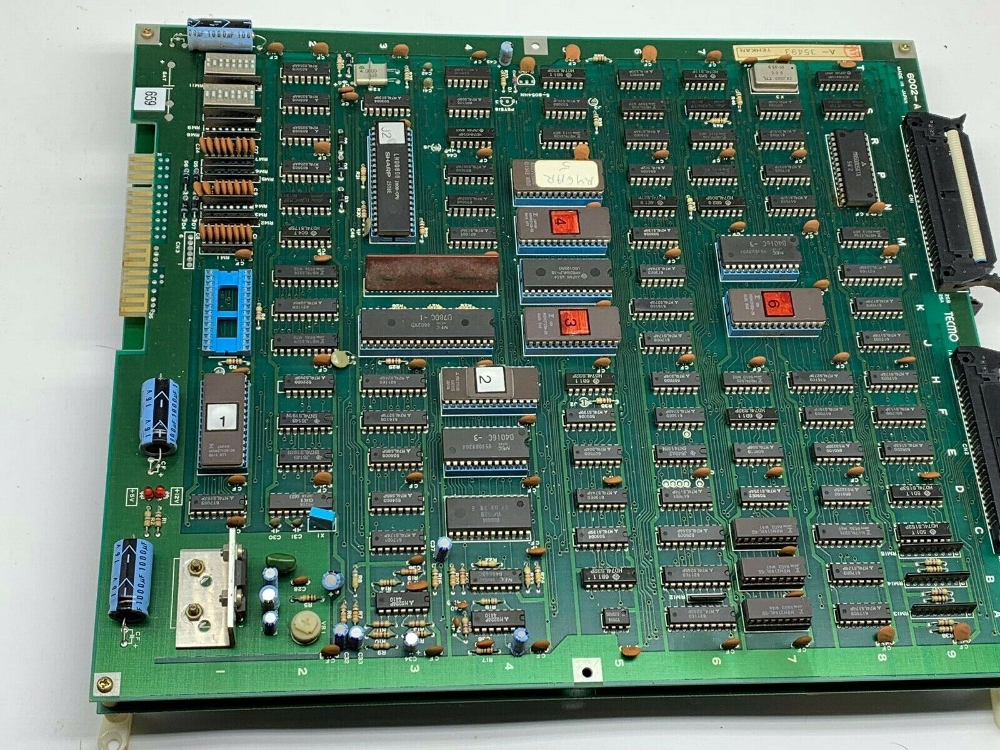
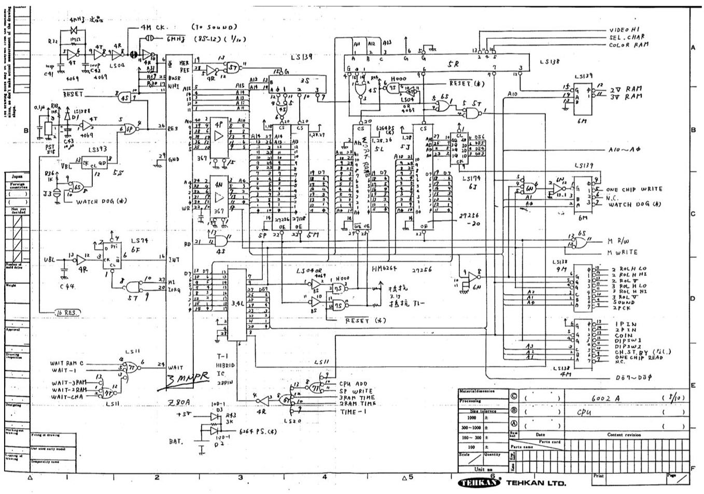
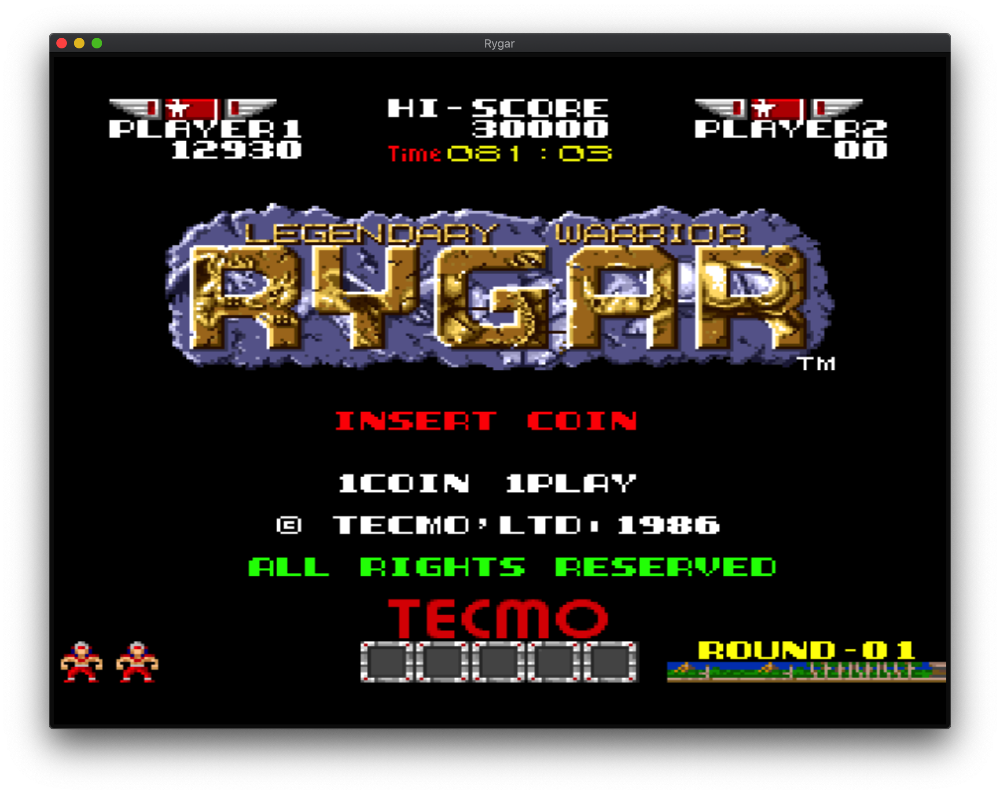

## Introduction

One of my favourite things to do as a kid in the 1980s was play arcade games. I was lucky that the small town where I lived had quite a few places where you could go play them. There were arcade machines in every milk bar, video store, pizzeria, and pub in town – as well as a couple of dedicated video arcades.

I remember going to one particular arcade next to a pizzeria with my mum and sisters after school, often spending an hour or two playing some of the classic games of that era. The 8- and 16-bit graphics of those early games are forever seared into my childhood memory.

Years later, I still enjoyed playing games at home on consoles like the Sega Master System and Sega Mega Drive, as the rise of video game consoles sadly brought an end to the golden era of video arcades. But for me, consoles could never truly recreate the authenticity of the arcade gaming experience. Why was that exactly?

I believe it was at least partly due to my nostalgia for the visceral experience of the arcade itself: the smell of pizzas cooking, a pocket full of coins, and the rows of arcade machines crafted out of plywood and vintage electronics, enticing my youthful retinas. But was there actually a measurable difference in the _quality_ of the games themselves?

Interestingly, it turns out there are actually technical reasons why the games purpose-built for the coin-operated arcades of the 80s and 90s are superior to the versions released on the video game consoles of the era. This is despite the fact that their circuit boards contained very similar – and in some cases identical – parts.

But until you actually _learn_ how an arcade machine works, you may not get to fully appreciate that fact.

Unfortunately, I didn’t have an arcade machine to dissect, so I decided to do the next best thing and _emulate_ one instead, using a virtual machine. I hoped that by building an emulator for a retro arcade game, I could learn something about the hardware wizardry inside the classic arcade games of the 80s and 90s.

## Rygar

The game I decided to write an emulator for is one of my all-time favourite arcade games: Rygar. It was originally built in 1986 by Tecmo, a Japanese video game company, and saw later releases on consoles like Nintendo Entertainment System, Sega Master System, Commodore 64, Atari Lynx, etc.

When we have a look at the raw computing power (e.g. CPU speed, memory, etc.) of the Rygar arcade machine hardware on paper, it isn't too dissimilar from what we would find running inside the video game consoles available at the time. But if we instead focus on the final product running on each platform – that is, the actual game itself – the difference is stark.

How could such similar components (CPU, RAM, ROM, etc.) give rise to vastly different gaming experiences on the various platforms available at the time?

The answer obviously lies in how those components were connected together, and what optimisations and trade-offs the engineers could make at the time. But to gain a deeper understanding, we have to dig further into the actual hardware.

One key insight is that early arcade machines were essentially a _single-purpose_ computer; they were designed to run one game only. To be fair, some arcade machines could run a handful of games, but in the early days, it wasn't uncommon for every arcade game to have its own bespoke hardware.

This was in contrast to more _general-purpose_ systems, like video game consoles, which were designed to run many different types of games, or home computers that were designed to run all kinds of different programs. These two different design constraints – single-purpose vs. general-purpose – are actually at odds with one another.

The engineers couldn't design a general-purpose computer that could run a single game better than a dedicated, purpose-built machine could. The term _better_ could be any metric – bigger, faster, more colours, more layers, more sprites, etc.

## Writing an Emulator

Before we jump in and start writing an emulator, we need to gather as much information as we can about the game's original hardware design. The most important piece of information we can use is a _schematic diagram_ of the original arcade hardware. I say _original_ because bootleg versions of some popular games were developed illegally, and may contain slightly different hardware to the original.

A schematic diagram – or _schematic_ – is a technical drawing that depicts how all the different components of the arcade hardware are connected together. It’s typically a multi-page document, with each page representing a different subsystem. The main subsystems of an arcade machine are:

- CPU
- Memory (RAM/ROM)
- Graphics (tilemaps, sprites, colours, etc.)
- Video output (CRT monitor driver)
- Sound (SFX and music)
- Input (joysticks, buttons, coin slots, dip switches, etc.)

To build an emulator, a general level of understanding of these subsystems is important, but thankfully we don't need to go all the way down to the individual component level of understanding for each subsystem.

Some of the subsystems, like CPU and memory, will require us to fully understand how they connect together in the original hardware design, but others may not be required in our emulator at all.

For example, the emulator is going to be running on a computer with access to some kind of pixel buffer, which is used to output graphics to the display. This means that we don't need to care too much about how the original video output subsystem works, as our emulator is not going to be directly driving a real CRT monitor. We can almost draw a big circle around the video output subsystem and say "who cares?".

If you want to learn about how each component functions, obviously you can, but you don't _need_ to know how everything works in order to build an emulator. Once you’ve got all the parts in place, you’ll be building your favourite childhood arcade games before you know it.

You can [run the emulator in your browser](https://rygar.joshbassett.info), or [check out the source code](http://github.com/nullobject/rygar).

_In part two, we’ll take a closer look at how the CPU subsystem works and build it into our emulator._

