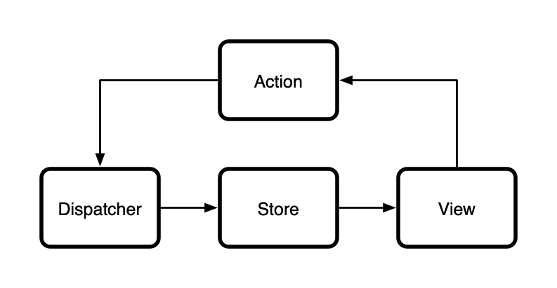
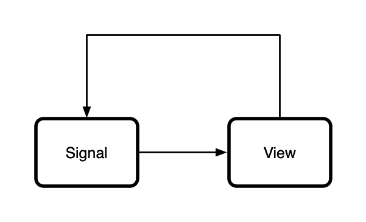

## Introduction

In the 'Real World Reactive Programming' series, I will be discussing how to
write reactive web applications with [React](https://reactjs.org) and
[Bulb](https://github.com/nullobject/bulb). The emphasis here is on 'real
world'. I intend to move beyond the toy examples that are commonly used to
introduce reactive programming, and talk about how to write functional,
understandable, and maintainable apps in JavaScript.

In this series, I will be starting with the basics, and quickly move on to
discuss how I wrote several games in the reactive style using Bulb.

## What is Bulb?

Bulb is a reactive programming library for JavaScript. It provides a simple API
for writing event-based programs in a declarative style.


The main data structure introduced by Bulb is called a _signal_. A signal
represents a time-varying source of values — for example, the value of a text
input, a periodic timer, or the position of the mouse pointer in the browser
window.

The Bulb API provides many functions for creating signals from various sources
(e.g. arrays, timers, AJAX requests, DOM events, etc.), as well as a whole
bunch of combinators that can be used to modify and connect signals in
different ways.

I should point out that a number of libraries already exist for reactive
programming in JavaScript (e.g. RxJS, Bacon.js, Most.js), but Bulb differs in
that it tries to avoid providing a 'kitchen sink'. Instead, Bulb defines a very
focussed API that contains only the key building blocks for reactive
programming in JavaScript.

## React and the Flux Architecture

The best place to start in this series is talking about how we can harness the
power and simplicity of reactive programming when building React web
applications.

These days, React is popular choice for building UI in your web apps, but
building a real world web app usually involves more than just rendering a
static view on a page. Other technologies are commonly required to handle
things like application state, business logic, and persistence.

One common architecture for managing the propagation of state in web
applications is
[Flux](https://facebook.github.io/flux/docs/in-depth-overview.html). The main
concept introduced by Flux is the notion of _unidirectional data flow_ — this
means that data can only propagate through your application in one direction.
Restricting the flow of data in this way makes it is far simpler to reason
about state changes in your application.



Conversely, when changes can propagate in multiple directions, such as with
the MVC architecture, the complex web of interactions can quickly become
overwhelming.

With Flux, _actions_ are created by the _views_ and given to the _dispatcher_,
in order to modify the application state, which is held in _stores_. Changes to
these stores trigger the UI to be redrawn.

## Reactive React Applications

Reactive programming similarly allows us to restrict the flow of data in our
applications, although in a much more intuitive way. Rather than rely on
dispatchers, stores, and actions, we can propagate data through our
applications using a single abstraction: _signals_.



Because signals are directed, we can be deliberate about the way connect them
together to manage the flow of data. Signals can also be stateful, which
eliminates the need for a separate abstraction to hold the application state.

Let's have a look at an [example](https://codepen.io/nullobject/pen/LqdERw):

```jsx
import React from "react";
import { Bus } from "bulb";
import { render } from "react-dom";
import { reverse } from "fkit";

const root = document.getElementById("root");
const bus = new Bus();
const stateSignal = bus.scan(transform, "hello world");

stateSignal.subscribe((value) =>
  render(<RootView bus={bus} value={value} />, root),
);

function transform(value, event) {
  if (event.type === "change") {
    value = event.value;
  } else if (event.type === "reverse") {
    value = reverse(value);
  }
  return value;
}

function RootView({ bus, value }) {
  return (
    <React.Fragment>
      <input
        onChange={(event) =>
          bus.next({ type: "change", value: event.target.value })
        }
        type="text"
        value={value}
      />
      <button onClick={() => bus.next({ type: "reverse" })}>Reverse</button>
    </React.Fragment>
  );
}
```

In this example we created a `bus` signal — which behaves much like a
dispatcher in Flux — and passed it into the `RootView` component as a prop.
When the view wants to trigger a change to the application state, it does so by
emitting an event on the `bus` signal.

The application state is produced by scanning a `transform` function over the
`bus` signal to create a new stateful signal called `stateSignal`. This signal
represents the current application state. When the `stateSignal` emits the
current application state (as a result of user input), it triggers a render of
the `RootView` component.


It's worth highlighting in this example that the application state isn't
explicitly stored anywhere — you can't just grab a reference to the state
whenever you want to, and start changing things. This is actually an important
restriction, because you can guarantee that the state only changes as a result
of data propagating through signals, and not from unintended side effects.

## Wrapping Up

In this article, we kicked off the 'Real World Reactive Programming' series to
talk about how to build reactive web applications using React and Bulb.

Flux is a popular architecture for managing the propagation of state in web
apps, but in my opinion it is completely unnecessary in the reactive
programming world. Signals allow us to achieve the holy grail of unidirectional
data flow with a single, powerful abstraction.

Stay tuned for more articles in this series, where I will be presenting more
real world examples of reactive programming. I don't have a mailing list, but
you can always [follow me on twitter](https://twitter.com/nullobject), where I
will announce new articles as I publish them.

The above example is also [available on
CodePen](https://codepen.io/nullobject/pen/LqdERw) if you want to play around
with it.

If you're interested in learning more about Bulb, I recommend checking out the
[project page on GitHub](https://github.com/nullobject/bulb).

